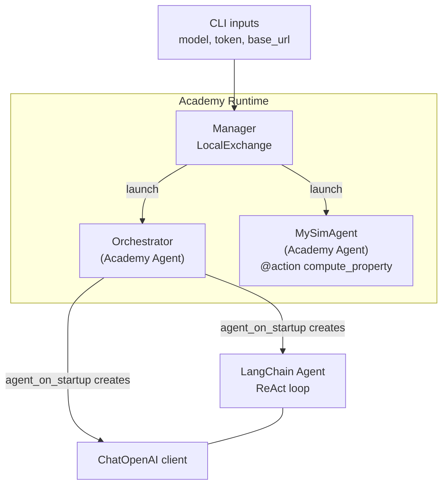
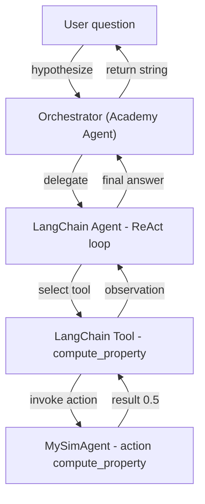

## LLM-Calling Agent

This small **agent-of-agents** example illustrates an LLM-powered orchestration pattern in which an LLM-powered orchestrator delegates scientific work to a simulation agent via well-defined actions. 
The
[**LangChain**](https://docs.langchain.com/oss/python/langchain/overview) agent framework is used to handle reasoning and tool selection;
 **Academy** supplies the agent lifecycle, communication, and execution substrate that allows simulation agents to be instantiated and accessed across heterogeneous environments.

> Warning: This example requires access to an OpenAI compatible language model API

This module contains additional dependencies to langchain and langchain-openai.

```
pip install langchain
pip install langchain-openai
```

## High-Level Overview

The program creates two Academy agents:
- **`Orchestrator`**, which embeds a LLM-powered LangChain agent that processes user requests and decides what tools to call via a [ReAct](https://react-lm.github.io)-style loop. (The LangChain agent uses the [**OpenAI API**](https://platform.openai.com/docs/api-reference/introduction) to access the LLM.)
- **`MySimAgent`**, a simulation agent that computes a molecular property  

The `Orchestrator` interprets natural-language questions, decides when to invoke tools (by invoking `MySimAgent`), and aggregates results from simulation agents.

In the following we first describe each program component and then present two figures that illustrate component interactions.

---

## Components (in the order that they appear in the program)

### 1. Simulation Agent (`MySimAgent`)

```python
class MySimAgent(Agent):
    @action
    async def compute_property(self, smiles: str) -> float:
        return 0.5
```
An Academy Agent exposing a single action: compute_property
- Accepts a SMILES string as input
- Returns a floating-point value (currently a stub value of 0.5)
- In a production system, this would run a real simulation or model

---

### 2. LangChain Tool Wrapper

```python
def make_sim_tool(handle: Handle[MySimAgent]) -> Tool:
    @tool
    async def compute_property(smiles: str) -> float:
        return await handle.compute_property(smiles)
    return compute_property
```

- Wraps an Academy agent **handle** as a LangChain **tool**
- Enables the LLM to invoke `compute_property(...)`
- The tool call is translated into an Academy action invocation
- This provides a clean integration point between LangChain and Academy

---

### 3. Orchestrator Agent

```python
class Orchestrator(Agent):
    async def agent_on_startup(self) -> None:
        llm = ChatOpenAI(
            model=self.model,
            api_key=self.access_token,
            base_url=self.base_url,
        )

        tools = [make_sim_tool(agent) for agent in self.simulators]
        self.react_loop = create_agent(llm, tools=tools)
```

- An **Academy Agent** that hosts a LangChain ReAct loop
- On startup:
  - Instantiates a `ChatOpenAI` client
  - Registers simulation agents as LangChain tools
  - Creates a tool-using LLM agent
- Serves as the central coordinator for the workflow

---

### 4. Orchestrator Action: `hypothesize`

```python
@action
async def hypothesize(self, goal: str) -> str:
    return await self.react_loop.ainvoke(
        {"messages": [{"role": "user", "content": goal}]},
    )
```

- Exposes a single high-level API method
- Accepts a natural-language goal or question
- Delegates reasoning and tool usage to LangChain
- Returns a natural-language response

---

## Execution Flow

1. **User provides configuration via CLI**
   - Model name (e.g., `gpt-4.1`)
   - Access token
   - Optional API base URL

2. **Academy Manager starts**
   - Uses a `LocalExchange` for in-process messaging

3. **Agents are launched**
   - One `MySimAgent` (simulation)
   - One `Orchestrator` (LLM-driven control)

4. **User question is submitted**
   ```text
   What is the simulated ionization energy of benzene?
   ```

5. **LLM reasoning loop**
   - Interprets the question
   - Determines that a tool call is required
   - Invokes `compute_property` via LangChain

6. **Simulation executes**
   - `MySimAgent.compute_property(...) → 0.5`

7. **Final response returned**
   - The LLM incorporates the result into a natural-language answer
  
---

## What This Example Demonstrates

- Clear separation between:
  - **Reasoning** (LangChain + LLM)
  - **Execution** (Academy agents)
- How to expose agent actions as LLM-callable tools
- How to embed LangChain inside a long-lived, managed agent
- A scalable pattern for scientific and autonomous workflows

---

## Notes and Extensions

- The simulation logic is currently a stub
- Multiple simulator agents can be registered for parallel execution
- The `LocalExchange` can be replaced with remote or distributed exchanges
- Tool docstrings directly influence LLM behavior and should be written carefully

---

## Figure 1 (Agent lifecycle and construction).
Academy initializes and manages agent lifecycles, launching the Orchestrator and simulation agents, within which the Orchestrator creates the LangChain agent and LLM client during startup.



## Figure 2 (Runtime request and tool invocation).
A user query is handled by the Orchestrator, delegated to a LangChain agent for reasoning and tool selection, executed by an Academy-managed simulation agent via a tool adapter, and returned as a synthesized response.



